# 🦋 Wings & Weights
### CNN vs. Vision Transformer for Butterfly Species Recognition


> A rigorous benchmarking study comparing lightweight CNNs (EfficientNet-B0, MobileNetV3-Small) against a Vision Transformer (DeiT-Tiny) for 50-class butterfly species classification — with GradCAM++ explainability and a live Streamlit demo.

---

## 📋 Table of Contents

- [Overview](#-overview)
- [Results at a Glance](#-results-at-a-glance)
- [Dataset](#-dataset)
- [Model Architectures](#-model-architectures)
- [Two-Phase Training Strategy](#-two-phase-training-strategy)
- [Ablation Studies](#-ablation-studies)
- [GradCAM++ Explainability](#-gradcam-explainability)
- [Project Structure](#-project-structure)
- [Setup & Usage](#-setup--usage)
- [Authors](#-authors)

---

## 🔭 Overview

Butterflies are sensitive ecological indicators — their population dynamics directly reflect ecosystem health. Manual species identification at scale is impractical, making automated image-based recognition critical for biodiversity conservation.

This project benchmarks **three lightweight architectures** under identical, controlled conditions using a **2-phase transfer learning protocol**:

- **Phase 1 (Epochs 1–7):** Frozen backbone — only the classification head is trained
- **Phase 2 (Epochs 8–14):** Partial fine-tuning — last blocks unfrozen with a lower learning rate

All experiments were run on a single **NVIDIA Tesla T4 GPU (15.6 GB)** with a fixed random seed of 42 for full reproducibility.

---

## 🏆 Results at a Glance

| Model | Type | Top-1 (%) | Top-3 (%) | F1 Score | Params (M) | Size (MB) | Inference (ms) |
|---|---|---|---|---|---|---|---|
| **DeiT-Tiny** | ViT | **98.00** | 99.60 | **0.9798** | 5.53 | 22.1 | **4.85** |
| EfficientNet-B0 | CNN | 96.40 | 99.60 | 0.9632 | 4.07 | 16.3 | 11.40 |
| MobileNetV3-Small | CNN | 96.00 | **100.00** | 0.9597 | 1.57 | 6.3 | 5.55 |

**Key finding:** DeiT-Tiny achieves the best accuracy *and* fastest GPU inference — challenging the assumption that Vision Transformers are always slower than CNNs.

> 📊 **Efficiency–Accuracy Tradeoff**
>
> 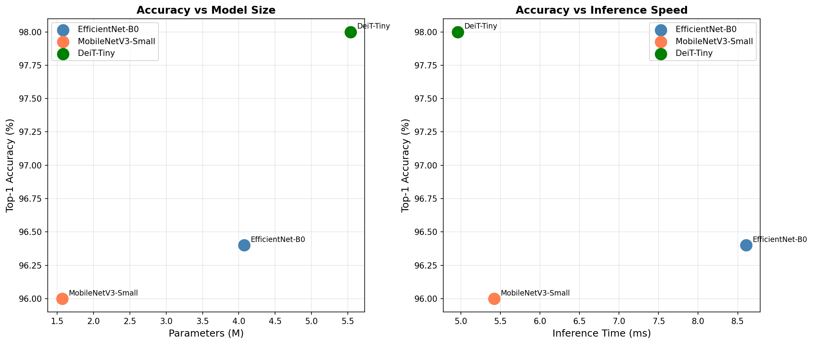

---

## 📦 Dataset

- **Source:** [Butterfly & Moths Image Classification (Kaggle)](https://www.kaggle.com/datasets/gpiosenka/butterfly-images40-species)
- **Subset:** 50 species randomly selected (seed=42) from 100 available
- **Split:** 6,273 training / 250 validation / 250 test images
- **Class imbalance ratio:** 1.66× (mean: 125.5 images/class, std: 14.4)
- **Input size:** All images standardized to 224×224 pixels

> 📊 **Class Distribution & Sample Grid**
>
> | Class Distribution | Sample Grid |
> |---|---|
> | 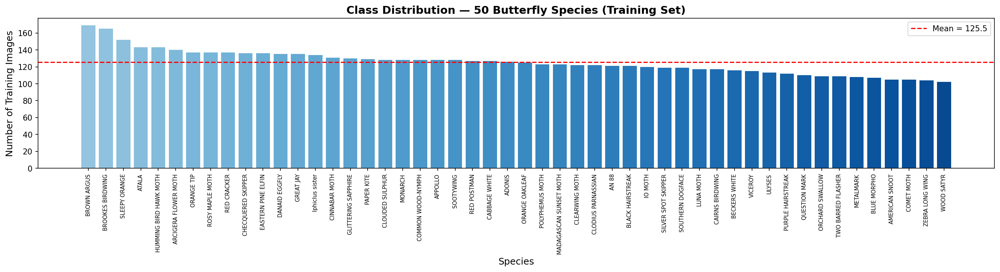 | 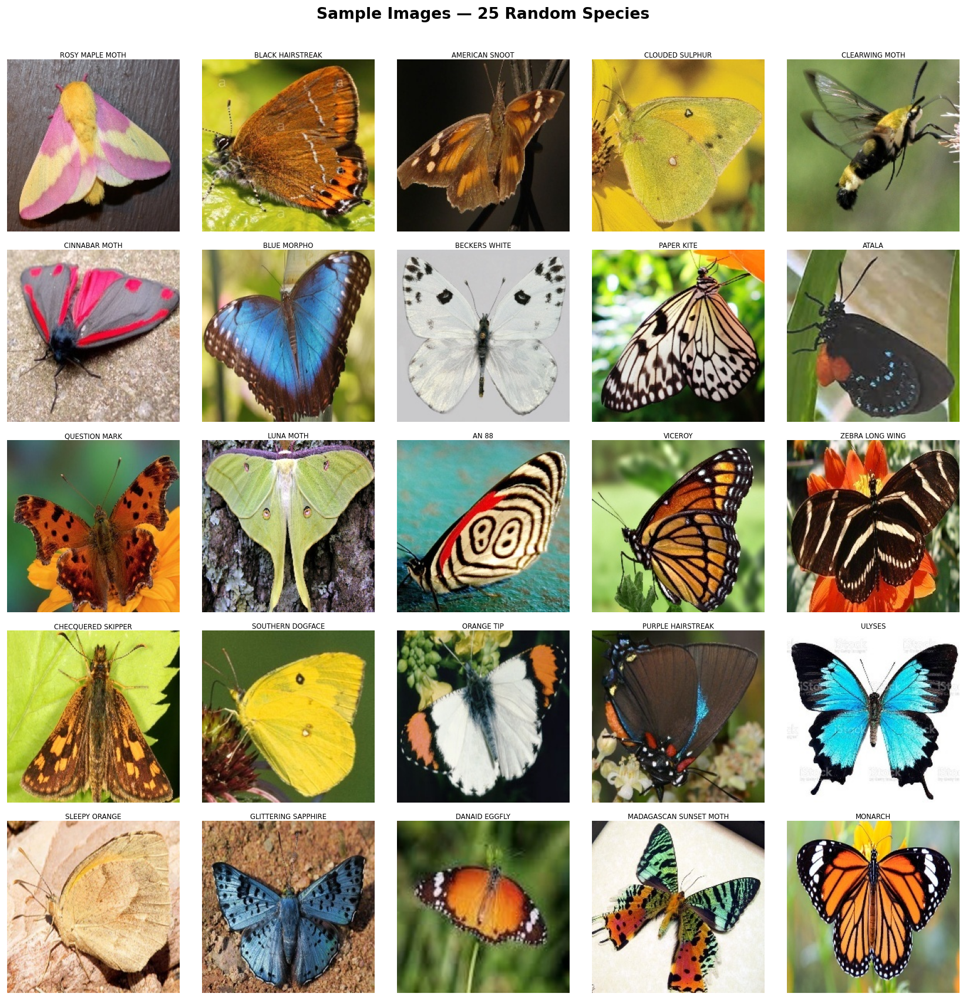 |

### Data Augmentation Pipeline

| Split | Transforms |
|---|---|
| Train | RandomResizedCrop(224), RandomHorizontalFlip(p=0.5), RandomRotation(15°), ColorJitter(brightness=0.3, contrast=0.3, saturation=0.2), ImageNet Normalization |
| Val / Test | Resize(256), CenterCrop(224), ImageNet Normalization |

Class imbalance was handled using **weighted cross-entropy loss** (weights = inverse of class sample counts).

---

## 🧠 Model Architectures

All three models were loaded from the [`timm`](https://github.com/huggingface/pytorch-image-models) library with **ImageNet pretrained weights**. Final classification heads were replaced with a linear layer mapping to 50 classes.

| Model | Type | Params (M) | Size (MB) | Phase 1 LR | Phase 2 LR |
|---|---|---|---|---|---|
| EfficientNet-B0 | CNN | 4.07 | 16.3 | 1e-3 | 1e-4 |
| MobileNetV3-Small | CNN | 1.57 | 6.3 | 1e-3 | 1e-4 |
| DeiT-Tiny | ViT | 5.53 | 22.1 | 1e-3 | 1e-4 |

- **EfficientNet-B0** — Uses compound scaling with depth-wise separable convolutions and squeeze-and-excitation modules for an accuracy-efficiency balance.
- **MobileNetV3-Small** — Ultra-lightweight (1.57M params) with hard-swish activation and SE blocks. Ideal baseline for edge deployment.
- **DeiT-Tiny** — Smallest practical Vision Transformer. 12 transformer layers, 3 attention heads, processes 196 patches (16×16) from a 224×224 image. Uses knowledge distillation for data-efficient training.

---

## 🔁 Two-Phase Training Strategy

```
Phase 1 (Epochs 1–7)    →   Frozen backbone, train head only    LR = 1e-3
Phase 2 (Epochs 8–14)   →   Partial unfreeze + fine-tuning       LR = 1e-4
```

**Unfrozen layers per model in Phase 2:**
- **EfficientNet-B0:** Block 6, head, classifier
- **MobileNetV3-Small:** Blocks 5 & 6
- **DeiT-Tiny:** Transformer blocks 10 & 11 + layer norm + head

**Optimizers:** Adam (CNNs) · AdamW (DeiT-Tiny)  
**Scheduler:** Cosine annealing (Phase 2 only)  
**Mixed-precision training** enabled for memory efficiency. Best checkpoint saved every epoch.

> 📈 **Training Curves**
>
> | EfficientNet-B0 | MobileNetV3-Small | DeiT-Tiny |
> |---|---|---|
> | 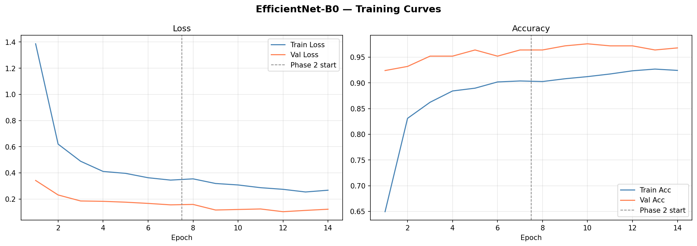 | 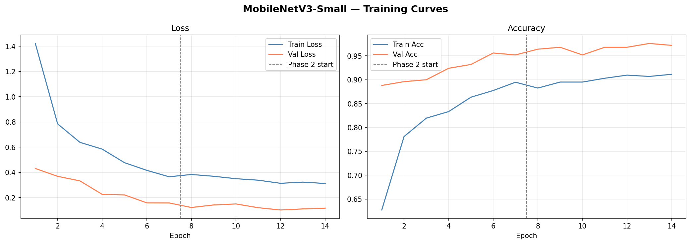 | 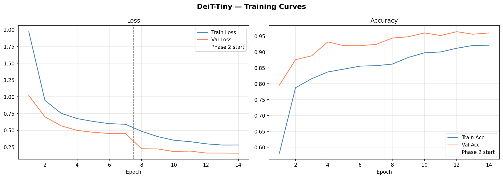 |

**Phase-wise accuracy gain:**

| Model | Phase 1 Val Acc. | Phase 2 Val Acc. | Gain |
|---|---|---|---|
| EfficientNet-B0 | 0.9640 | 0.9760 | +0.0120 |
| MobileNetV3-Small | 0.9560 | 0.9760 | +0.0200 |
| **DeiT-Tiny** | 0.9320 | 0.9640 | **+0.0320** |

> 📊 **Phase Comparison**
>
> 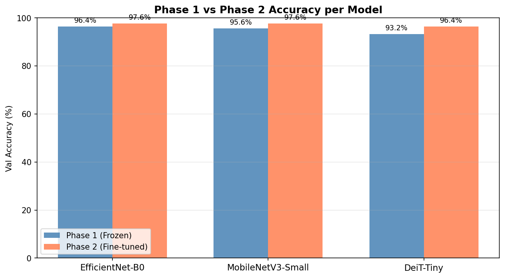

---

## 🔬 Ablation Studies

### Ablation 1 — Effect of Data Augmentation (EfficientNet-B0, Phase 1)

| Training Condition | Best Val Accuracy | Delta |
|---|---|---|
| With Augmentation | 0.9640 | — |
| Without Augmentation | 0.9760 | +0.0120 (no-aug better) |

The no-augmentation baseline performs slightly better because the dataset already contains clean, standardized 224×224 images with ~125 examples per class. Aggressive augmentation (especially RandomResizedCrop) can inadvertently remove discriminative wing features during Phase 1 when only the head is being trained.

> 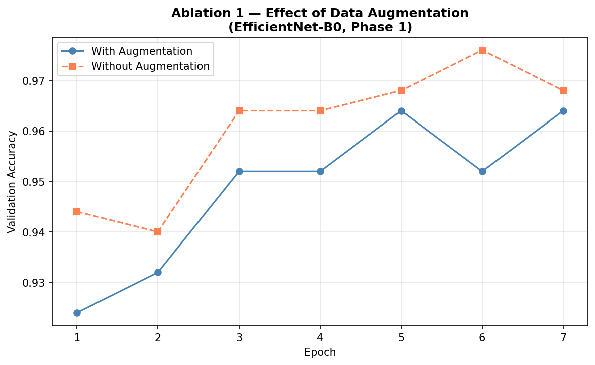

### Ablation 2 — Fine-tuning Gain per Architecture

| Model | Phase 1 Test Acc. | Phase 2 Test Acc. | Gain |
|---|---|---|---|
| EfficientNet-B0 | 0.9440 | 0.9640 | +0.0200 |
| MobileNetV3-Small | 0.9360 | 0.9600 | +0.0240 |
| **DeiT-Tiny** | 0.9160 | **0.9800** | **+0.0640** |

DeiT-Tiny shows the largest fine-tuning gain (+6.40%), confirming that Vision Transformers learn general attention patterns in Phase 1 and strongly benefit from domain-specific fine-tuning in Phase 2.

> 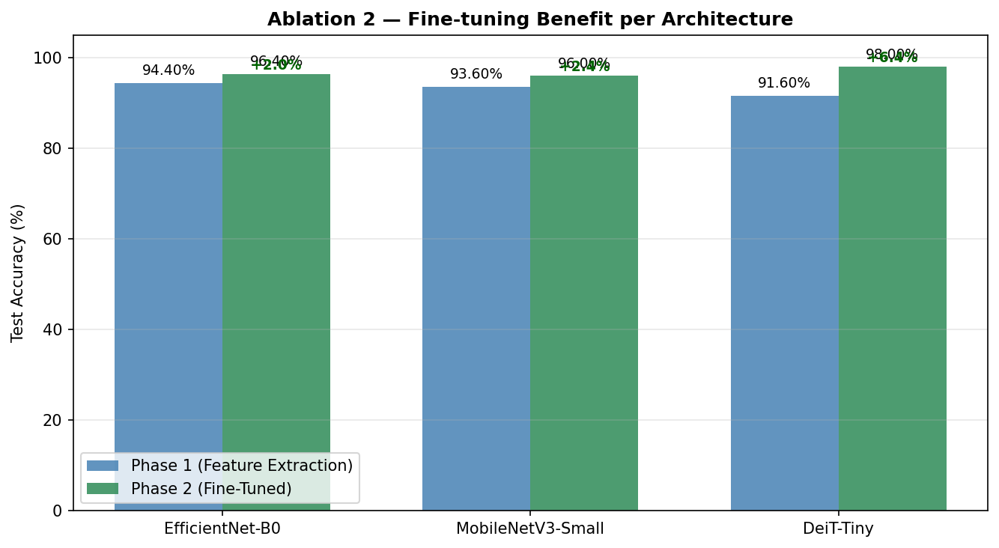

---

## 🗺️ GradCAM++ Explainability

GradCAM++ was applied to the **last convolutional layer** for CNNs and to a **spatial feature map reconstructed from 196 patch tokens** for DeiT-Tiny.

- ✅ **Correct predictions:** All models attend to butterfly wings — specifically eyespots, color bands, and wing edges.
- ❌ **Incorrect predictions:** Heatmaps reveal attention drifting to backgrounds or similar-looking wing undersides (e.g., Brown Argus vs. Adonis Blue).

> | EfficientNet-B0 (Correct) | EfficientNet-B0 (Wrong) |
> |---|---|
> | 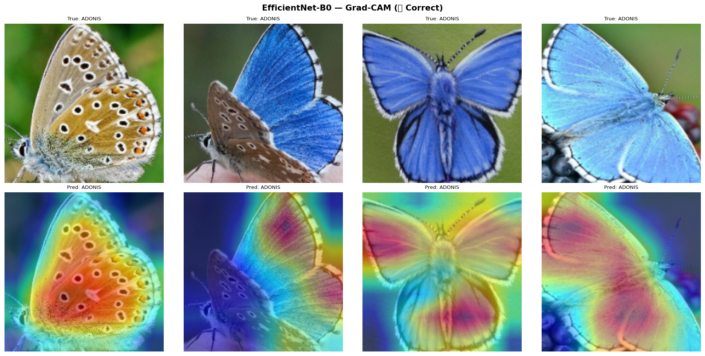 | 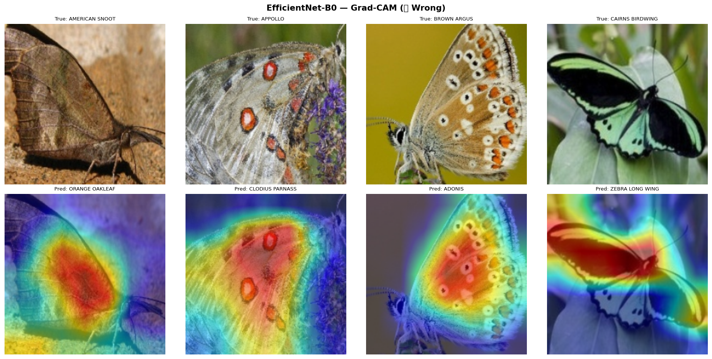 |
>
> | DeiT-Tiny (Correct) | DeiT-Tiny (Wrong) |
> |---|---|
> | 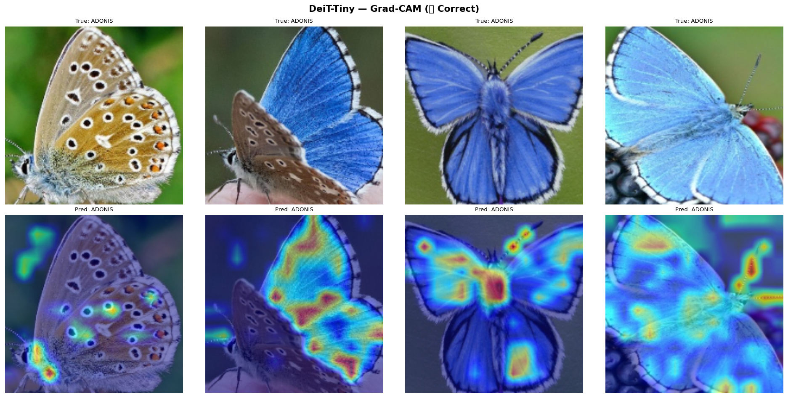 | 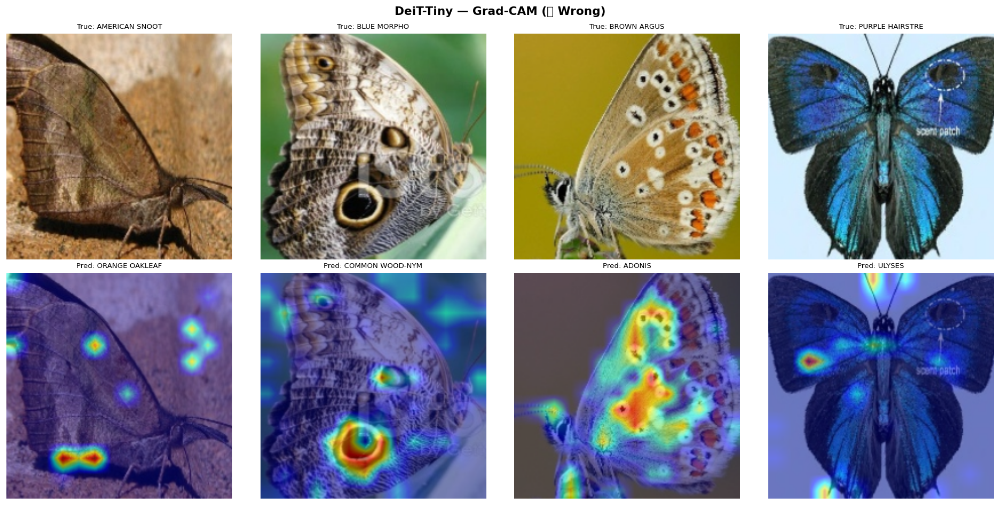 |
>
> **Demo Dashboard** (Top-5 confidence + GradCAM overlays for 6 test samples):
>
> 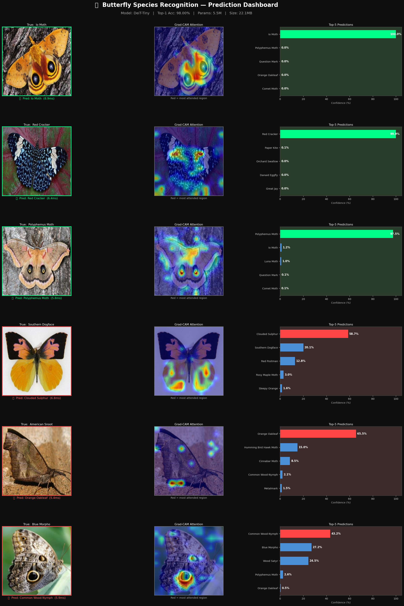

---

## 📁 Project Structure

```
wings-and-weights/
│
├── README.md
├── requirements.txt
│
├── notebooks/
│   └── wings_and_weights.ipynb       # Full training, evaluation & explainability pipeline
│
├── plots/                             # All generated figures
│   ├── eda_class_distribution.png
│   ├── eda_sample_grid.png
│   ├── eda_resolution.png
│   ├── curves_EfficientNet-B0.png
│   ├── curves_MobileNetV3-Small.png
│   ├── curves_DeiT-Tiny.png
│   ├── cm_EfficientNet-B0.png
│   ├── cm_MobileNetV3-Small.png
│   ├── cm_DeiT-Tiny.png
│   ├── gradcam_EfficientNet-B0_correct.png
│   ├── gradcam_EfficientNet-B0_wrong.png
│   ├── gradcam_MobileNetV3-Small_correct.png
│   ├── gradcam_MobileNetV3-Small_wrong.png
│   ├── gradcam_DeiT-Tiny_correct.png
│   ├── gradcam_DeiT-Tiny_wrong.png
│   ├── scatter_tradeoffs.png
│   ├── phase_comparison.png
│   ├── ablation1_augmentation.png
│   └── ablation2_finetuning.png
│
├── app/
│   ├── app.py                         # Streamlit demo app
│   ├── classes.json
│   └── DeiT-Tiny_phase2_best.pt
└── report/
    └── 8th_Major_Project_Report.docx
```

---

## ⚙️ Setup & Usage

### 1. Clone the repository

```bash
git clone https://github.com/prabhu-313/wings-and-weights.git
cd wings-and-weights
```

### 2. Install dependencies

```bash
pip install -r requirements.txt
```

### 3. Download the dataset

Download the [Butterfly & Moths dataset from Kaggle](https://www.kaggle.com/datasets/gpiosenka/butterfly-images40-species) and place it as:

```
data/
├── train/
├── valid/
└── test/
```

### 4. Run the notebook

```bash
jupyter notebook notebooks/wings_and_weights.ipynb
```

### 5. Launch the Streamlit app

```bash
streamlit run app/app.py
```

---

## 👥 Authors

This project was completed as an 8th Semester Major Project at **KIIT University, Bhubaneswar, Odisha**.

| Name | Role | Email |
|---|---|---|
| **Prabhupada Samantaray** | Author | psray313@gmail.com |
| **Aradhana Behura** | Guide | aradhana.behurafcs@kiit.ac.in |

---

## 📄 License

This project is licensed under the MIT License.
